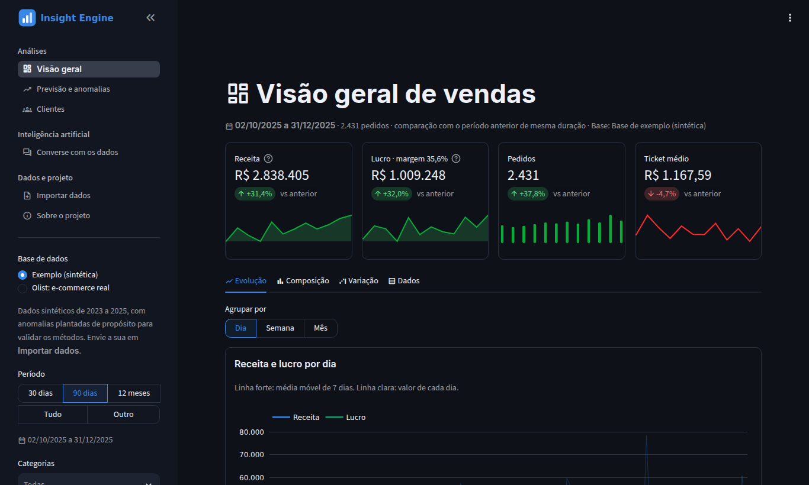
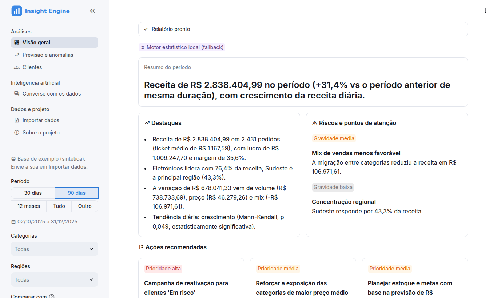
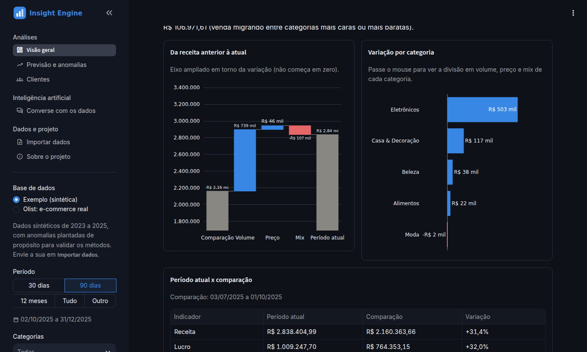
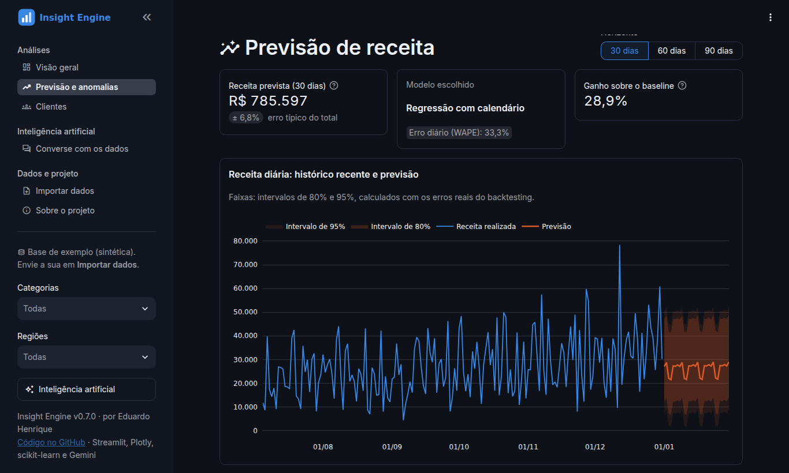
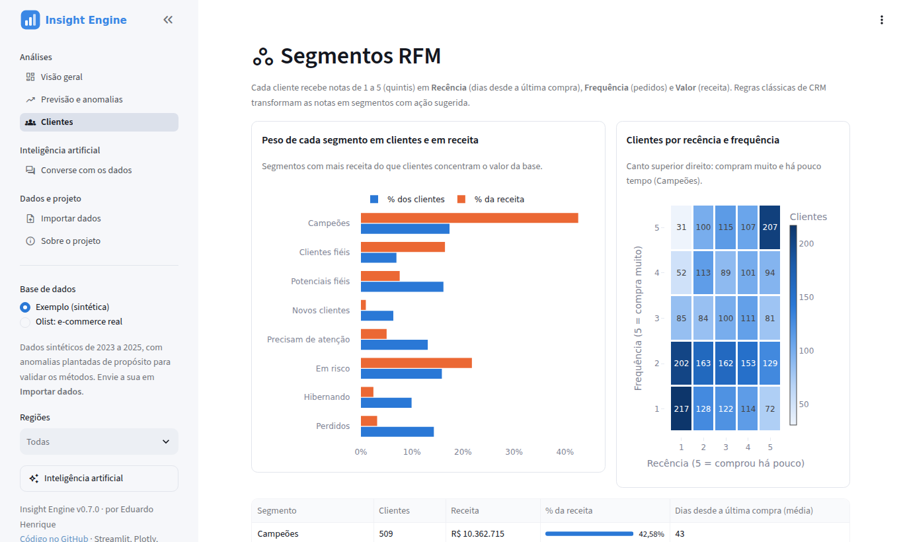
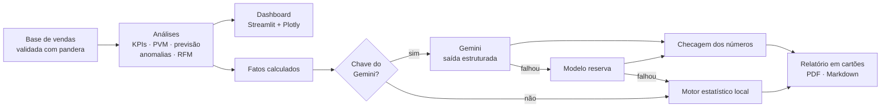

# Insight Engine — Dashboard Executivo de Vendas com IA

[](https://github.com/EduardoHenrique15/Sales-IA-Dashboard/actions/workflows/ci.yml)


Transforma uma planilha de vendas em um painel executivo: indicadores, variação explicada, previsão,
detecção de anomalias e segmentação de clientes — com um **relatório escrito por IA em que cada número
citado é conferido contra os dados**. Sem chave de IA, tudo continua funcionando com um motor estatístico local.

**🔗 Demo:** _em breve (Streamlit Community Cloud)_



---

## O que ele faz

| | |
|---|---|
| **Visão executiva** | KPIs com variação e minigráfico, meta de receita, comparação com o período anterior ou com o mesmo período do ano anterior. Filtros que viram link compartilhável e filtro por clique nos gráficos. |
| **Variação explicada** | A mudança da receita decomposta em **volume, preço e mix** (análise PVM), no total e por categoria. |
| **Previsão** | Três modelos competem em **backtesting**; vence o de menor erro, e os intervalos de confiança vêm dos erros reais. |
| **Anomalias** | Decomposição **STL** + z-score robusto (MAD) + piso de materialidade, para apontar dias fora do padrão sem alarmes falsos. |
| **Clientes** | Segmentos **RFM** com ação sugerida, comparados a grupos do **K-Means** escolhidos pelo coeficiente de silhueta. |
| **Relatório com IA** | Gemini com **saída estruturada** (destaques, riscos por gravidade, ações por prioridade), exportável em PDF e Markdown. |
| **Chat com os dados** | Perguntas em linguagem natural respondidas por **chamada de funções** seguras — a IA consulta, não executa código. |
| **Seus dados** | Importação de CSV/Excel com mapeamento automático de colunas e números no formato brasileiro (`R$ 1.234,56`). |

<table>
  <tr>
    <td></td>
    <td></td>
  </tr>
  <tr>
    <td></td>
    <td></td>
  </tr>
</table>

---

## Destaques técnicos

**Uma única fonte de números.** O dashboard, o relatório e o chat leem os mesmos fatos calculados
(`insight_engine/ai/context.py`). A IA só redige e escolhe o que destacar; ela não calcula.

**IA verificável.** Um verificador extrai os números do texto da IA (`R$ 2,84 milhões`, `31,4%`...) e confere
cada um contra os dados, com tolerância a arredondamento. A tela mostra "15 de 15 números conferidos" — ou
avisa exatamente quais números não aparecem nos dados.

**IA avaliada com números.** Um conjunto de 25 perguntas com gabarito calculado direto dos dados mede a taxa
de acerto do chat, as alucinações, a escolha da consulta certa, a latência e o custo em tokens, incluindo
perguntas sem resposta e uma tentativa de extrair a chave de API. A primeira rodada encontrou 4 falhas; cada uma
virou um ajuste no prompt ou nas consultas, e a segunda rodada mediu o efeito:

| Rodada (`gemini-flash-lite-latest`) | Acerto | Sem alucinação | Números do relatório conferidos |
|---|---|---|---|
| v1 | 88% | 96% | 100% |
| v2, após os ajustes | **100%** | **100%** | 100% |

O 100% vale para estas perguntas, usadas também para encontrar as falhas; o [método](evals/README.md) explica
esse limite e o que mudou de uma rodada para a outra.

**Resiliência.** Se o modelo principal falhar, o app tenta de novo com espera crescente, depois usa um modelo
reserva e, por último, o motor estatístico local, que gera o **mesmo objeto de relatório** (um único
renderizador para as duas origens). O motivo da falha aparece na tela.

**Previsão avaliada como em produção.** Ingênuo sazonal (baseline), Holt-Winters e regressão com calendário
são treinados só com o passado e testados em janelas que não viram (*rolling-origin*). Na base de exemplo:

| Métrica (horizonte de 30 dias) | Resultado |
|---|---|
| Modelo escolhido | Regressão com calendário |
| Erro diário (WAPE) | 33,3% |
| Erro do **total** do período | ±6,8% |
| Ganho sobre o baseline | 28,9% |

O dia a dia de vendas é ruidoso (poucos pedidos caros mudam um dia inteiro), mas o total do mês é bem
previsível — e é ele que importa para metas e estoque.

**Anomalias validadas com gabarito.** A base sintética tem 3 anomalias plantadas (queda no checkout, campanha
relâmpago, site fora do ar). Detectando em **pedidos por dia**, o método encontra **3 de 3** com 7 alertas em
1.096 dias; em **receita**, só 1 de 3, porque poucos pedidos caros escondem o incidente. A lição virou padrão
do app: pedidos é a métrica sugerida para incidentes.

**Segmentação que se valida.** RFM (regras de negócio) e K-Means (não supervisionado, k escolhido pela
silhueta a partir de 3) chegam a grupos parecidos — os 20% melhores clientes concentram 68% da receita.

**Engenharia.**
- Mais de 200 testes automatizados (pytest), incluindo a interface com `AppTest`, cobertura mínima de 90%.
- CI no GitHub Actions em Python 3.11 e 3.12, com ruff (lint e formatação) e mypy.
- Testes **nunca** usam chaves reais nem internet: qualquer conexão de saída é bloqueada.
- Validação de dados com pandera; saída da IA validada com Pydantic; dependências travadas com `uv`.

### Como a IA funciona



---

## Como rodar localmente

Requer Python 3.11 ou 3.12.

```bash
git clone https://github.com/EduardoHenrique15/Sales-IA-Dashboard.git
cd Sales-IA-Dashboard

python -m venv .venv
source .venv/bin/activate        # Windows: .venv\Scripts\activate
pip install -r requirements.txt

streamlit run app.py
```

O app abre em `http://localhost:8501` com uma base de vendas sintética (2023 a 2025, cerca de 20 mil pedidos).

### IA generativa (opcional)

Copie `.env.example` para `.env` e preencha a chave (gratuita em
[aistudio.google.com/app/apikey](https://aistudio.google.com/app/apikey)):

```
GEMINI_API_KEY=sua_chave
GEMINI_MODEL=gemini-2.5-flash
```

Também dá para colar uma chave no painel **Inteligência artificial**, na barra lateral, sem salvar nada.

| Variável | Padrão | Para que serve |
|---|---|---|
| `GEMINI_API_KEY` | — | Ativa o relatório e o chat com IA |
| `GEMINI_MODEL` | `gemini-flash-latest` | Modelo principal |
| `GEMINI_FALLBACK_MODEL` | `gemini-flash-lite-latest` | Modelo reserva se o principal falhar |
| `SERVER_KEY_CALLS_PER_HOUR` | `20` | Limite por visitante da chave do projeto |
| `SERVER_KEY_CALLS_PER_DAY` | `300` | Limite diário total da chave do projeto |
| `LOG_LEVEL` | `INFO` | Detalhe dos logs no terminal |

### Usando seus dados

Em **Importar dados**, envie um CSV ou Excel com **um pedido por linha**. Só **data** e **receita** são
obrigatórias; com **custo**, o app calcula lucro e margem; com **cliente**, libera a segmentação. As colunas
são reconhecidas pelo nome (dá para ajustar) e há uma planilha-modelo para baixar. O arquivo fica só na sessão
do navegador: não é salvo nem compartilhado.

---

## Estrutura

```
app.py                     # configuração, navegação e barra lateral comum
app_pages/                 # uma página por arquivo (visão geral, previsão, clientes, chat, importação, sobre)
insight_engine/
├── data/                  # base sintética, importação de planilhas e validação (pandera)
├── analytics/             # KPIs, períodos, PVM, tendência, previsão, anomalias, RFM/K-Means
├── ai/                    # contexto, prompts, relatório estruturado, verificador, chat, PDF, limites
│   └── providers/         # interface LLMProvider + implementação do Gemini
└── ui/                    # tema, gráficos, componentes, filtros e cache do Streamlit
evals/                     # avaliação da IA: perguntas com gabarito, pontuação e comparação de modelos
tests/                     # testes unitários e de interface (rede bloqueada)
.streamlit/config.toml     # tema claro/escuro, fonte e cores
```

A lógica fica no pacote `insight_engine/` e as páginas só montam a tela. Trocar o Gemini por outro modelo é
implementar a interface `LLMProvider` (`insight_engine/ai/providers/base.py`); nos testes, um provedor falso
faz esse papel.

---

## Desenvolvimento

```bash
pip install -r requirements-dev.txt

pytest                     # testes (com cobertura: pytest --cov)
ruff check .               # lint
ruff format .              # formatação
mypy                       # tipos
python -m evals.run        # avaliação da IA (precisa de GEMINI_API_KEY)
```

As dependências diretas ficam no `pyproject.toml`; as versões exatas, em `requirements.txt` e
`requirements-dev.txt`, geradas com [uv](https://github.com/astral-sh/uv) (o comando está no topo de cada arquivo).

---

## Deploy no Streamlit Community Cloud

1. Em [share.streamlit.io](https://share.streamlit.io), crie um app a partir deste repositório, com `app.py`
   como arquivo principal e **Python 3.12** nas opções avançadas.
2. Em **Secrets**, cole o conteúdo de `.streamlit/secrets.toml.example` com a sua chave.

Os limites de uso protegem a cota da chave do projeto contra visitantes; quem colar a própria chave no app usa
a cota dela, sem limite.

---

## Limitações conhecidas

- A base de exemplo é **sintética** (gerada com sazonalidade, tendência, ruído e anomalias plantadas): serve
  para demonstrar o método, não descreve uma empresa real.
- O chat precisa de uma chave do Gemini; o relatório funciona sem ela.
- O limite por visitante vale por sessão (abrir outra aba recomeça a contagem); o limite diário total é o que
  protege a cota de fato.
- Ao trocar o tema claro/escuro pelo menu, as cores dos gráficos se ajustam na interação seguinte.

---

## Stack

Python · Streamlit · pandas · NumPy · Plotly · statsmodels · scikit-learn · SciPy · pandera · Pydantic ·
Google Gemini (`google-genai`) · fpdf2 · pytest · ruff · mypy · GitHub Actions

## Licença

[MIT](LICENSE) — Eduardo Henrique
